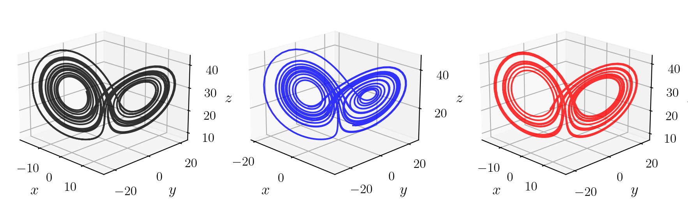

# Tutorials: Predictions in Chaotic Dynamical Systems 

This is a tutorial to employ echo state networks (ESNs) and long short-term memory networks (LSTMs) for the prediction and analysis of chaotic dynamics. 
This library contains both `Tensorflow` and `PyTorch` implementations for the LSTM and employs the [Magrilab/EchoStateNetowrk](https://github.com/MagriLab/EchoStateNetwork). Please note that encountered issues may be addressed there. 

The example system found here is the Lorenz 63 system, which is found in `dynamicalsystems.equations`

$$
\begin{aligned}
		&\dfrac{\mathrm{d}x}{\mathrm{d}t} = \sigma (y-x) \\
		&\dfrac{\mathrm{d}y}{\mathrm{d}t} = x (\rho-z) - y \\
		&\dfrac{\mathrm{d}z}{\mathrm{d}t} = xy - \beta z.
\end{aligned}
$$

## **Attractor reconstruction by reference (black), LSTM (blue) and ESN (red):**

## **Requirements:**
You can find a list of requirements in requirements.txt
